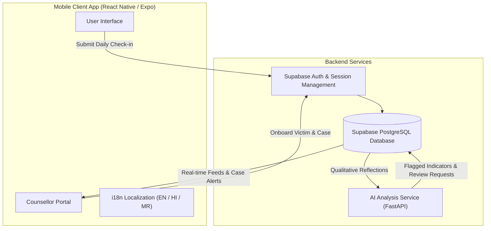

# ArohaAI

**AI-Powered Dynamic Mental Health Monitoring and Distress Prediction System**  
*SIH 2026 Prototype*

---

## 1. Overview

**ArohaAI** is an AI-assisted mental health care and longitudinal monitoring platform designed to support individuals navigating emotional distress, trauma, or wellbeing challenges. It bridges the gap between individuals and healthcare professionals through structured daily check-ins, counsellor-led onboarding, and real-time monitoring feeds.

The platform establishes a secure, human-in-the-loop care workflow:

$$\text{Victim / User} \longrightarrow \text{Daily Check-in} \longrightarrow \text{Backend Storage} \longrightarrow \text{AI-Assisted Analysis} \longrightarrow \text{Counsellor Dashboard} \longrightarrow \text{Clinical Review} \longrightarrow \text{Structured Follow-up}$$

> **Important Clinical Note:** AI capabilities in ArohaAI serve strictly as an assistive tool to summarize reflections and flag monitoring indicators for professional review. AI never provides direct clinical diagnoses or replaces professional human counsellor judgment.

---

## 2. Problem Statement

Traditional mental health care and victim support systems face several critical operational challenges:

- **Lack of Continuous Monitoring:** Patients/victims are typically evaluated only during sporadic in-person appointments, leaving long unmonitored intervals.
- **Irregular Follow-up:** Difficulty tracking whether individuals maintain daily wellness routines or experience sudden emotional downturns.
- **Hidden Longitudinal Trends:** Clinicians lack continuous qualitative data to identify gradual behavioral changes over time.
- **Administrative Burden:** Counsellors face heavy manual documentation loads when managing multiple cases simultaneously.

---

## 3. Proposed Solution

ArohaAI introduces a dual-sided, mobile-first care management ecosystem:

1. **Counsellor-Led Victim Onboarding:** Counsellors directly register victims, record formal consent, collect baseline assessments, and establish support cases.
2. **Structured Wellbeing Check-ins:** Users submit daily reflections using simple, empathetic language without exposing intimidating diagnostic metrics or internal distress scores to the user.
3. **AI-Assisted Monitoring Pipeline:** Background AI services analyze qualitative check-in submissions to highlight key indicators (e.g., mood fluctuations, sleep disruption) and flag cases requiring counsellor review.
4. **Counsellor Dashboard & Alert System:** Counsellors receive real-time case feeds, overdue follow-up alerts, and direct contact options to initiate timely interventions.

---

## 4. User Roles & Workflows

### Counsellor Role
Counsellors manage care plans, review victim check-in feeds, and schedule consultations:

$$\text{Counsellor Login} \longrightarrow \text{Dashboard} \longrightarrow \text{Cases List} \longrightarrow \text{Case Details} \longrightarrow \text{Alerts} \longrightarrow \text{Appointments} \longrightarrow \text{Profile}$$

- **Dashboard:** Overview of active cases, upcoming follow-ups, overdue sessions, and cases needing review.
- **Victim Registration:** Multi-step wizard to record personal details, consent documentation, case stage, and baseline assessment indicators.
- **Case Management:** Review case metadata, baseline dimensions, daily check-in activity, and schedule sessions.
- **Alerts Feed:** High-priority notifications for monitoring reviews and upcoming consultations.

### User / Victim Role
Users focus on their personal daily wellbeing space with zero exposure to internal risk scores or complex medical jargon:

$$\text{User Home} \longrightarrow \text{Check-in Form} \longrightarrow \text{Submission Confirmation} \longrightarrow \text{Schedule} \longrightarrow \text{Routine} \longrightarrow \text{Profile}$$

- **User Home:** Personalized greeting, today's check-in CTA, assigned counsellor contact card, upcoming appointment reminder, and daily routine.
- **Check-in Form:** Simple 4-option feeling selector (*"I'm feeling okay"*, *"I'm having a difficult day"*, *"I'm struggling"*, *"I need support"*), optional counsellor message, and support contact request (`Yes` / `No`).
- **Submission Confirmation:** Immediate confirmation screen ensuring privacy and security (*"Check-in submitted securely"*).
- **Assigned Counsellor Card:** Direct access to assigned counsellor name, phone number, and one-tap call functionality (`tel:` link).

---

## 5. Core Features

### Implemented in Prototype
- **Role-Based Authentication:** Multi-role entry for Counsellors and Users via Supabase Auth architecture.
- **Counsellor-Led Onboarding Wizard:** 4-step victim registration flow with consent recording, stage assignment, and baseline assessment inputs.
- **Defensive Case Management:** Counsellor cases view with search filtering, stage chips (`Active`, `Assessment`, `Follow-up`, `Closed`), and safe optional-access rendering.
- **Empathetic User Check-in:** 100% current-form check-in experience with secure confirmation and zero exposed risk scores.
- **Assigned Counsellor Card:** Relational lookup displaying assigned counsellor details and phone call confirmation.
- **Multilingual Support (i18n):** Complete localization support for English, Hindi (हिंदी), and Marathi (मराठी).
- **Presentation Mode:** Safe, offline prototype mode with pre-populated, realistic fictional datasets for SIH evaluation (`APP_CONFIG.presentationMode = true`).

### Future Scope
- **Voice Reflection Transcription:** Speech-to-text integration for check-in reflections.
- **Longitudinal Trend Charts:** Graphical visualizer for multi-month mood and routine trends in counsellor view.
- **Automated Push Notifications:** Daily check-in reminders and scheduled session alerts via Expo Notifications.

---

## 6. System Architecture



---

## 7. Technology Stack

- **Frontend Framework:** React Native 0.86 (Expo SDK 57)
- **Navigation & UI:** Custom Vector Icon System, Safe Area Context, Responsive Mobile Layouts
- **State & Storage:** React Context, `@react-native-async-storage/async-storage`
- **Backend & Database:** Supabase (`@supabase/supabase-js`), PostgreSQL with Row-Level Security (RLS)
- **AI Integration Service:** Python / FastAPI Microservice (`ai-service/`)
- **Localization:** i18n Provider supporting English, Hindi, and Marathi

---

## 8. Repository Structure

```
ArohaAI-Mobile/
├── App.js                      # Root Application Component
├── index.js                    # Expo Entry Point
├── app.json                    # Expo App Configuration
├── package.json                # Dependencies and npm scripts
├── assets/                     # Splash screens and application icons
├── src/
│   ├── counsellor/             # Counsellor feature domain
│   │   ├── navigation/         # Counsellor bottom navigation
│   │   ├── screens/            # Counsellor Home, Cases, Add Victim, Alerts, Appointments, Profile
│   │   └── services/           # Case service, dashboard service, appointment service
│   ├── user/                   # User feature domain
│   │   ├── components/         # CounsellorCard, RoutineSection, AppointmentSection, CheckInMoodSelector
│   │   ├── navigation/         # User bottom navigation
│   │   ├── screens/            # User Home, Check-in, Appointments, Routine, Profile
│   │   └── services/           # Check-in service, counsellor service, appointment service
│   ├── shared/                 # Shared architecture & utilities
│   │   ├── components/         # Icon, ArohaLogo
│   │   ├── config/             # App configuration (APP_CONFIG.presentationMode)
│   │   ├── demo/               # Safe mock demo dataset (DEMO_CASES, DEMO_COUNSELLOR_PROFILE)
│   │   ├── i18n/               # i18n Provider & translations (English, Hindi, Marathi)
│   │   ├── services/           # Centralized auth service
│   │   └── theme/              # Color palette, spacing, border radii
│   └── lib/
│       └── supabase.js         # Supabase client setup with safe AsyncStorage
├── supabase/
│   └── migrations/             # SQL schema migrations (001_create_profiles to 006_create_interventions)
├── ai-service/                 # FastAPI microservice for qualitative check-in analysis
└── backend/                    # Node.js API integration wrapper
```

---

## 9. Getting Started

### Prerequisites
- Node.js (v18 or higher)
- Expo Go App on a physical mobile device (Android / iOS)

### Installation & Execution

1. **Clone the Repository:**
   ```bash
   git clone https://github.com/Shreyashkhandar/ArohaAI-mobile.git
   cd ArohaAI-Mobile
   ```

2. **Install Dependencies:**
   ```bash
   npm install
   ```

3. **Start the Expo Development Server:**
   ```bash
   npx expo start -c
   ```

4. **Run on Mobile Device:**
   Scan the displayed QR code using the **Expo Go** application on your physical Android or iOS device.

---

## 10. Presentation Mode & Configuration

The application includes a centralized configuration toggle located at [`src/shared/config/appConfig.js`](file:///c:/Users/User/ArohaAI-Mobile/src/shared/config/appConfig.js):

```javascript
export const APP_CONFIG = {
  presentationMode: true, // true = SIH Evaluation Mode (Offline Demo Dataset)
};
```

- **`presentationMode: true` (Default):** Enables a self-contained prototype evaluation mode pre-populated with realistic fictional cases (`Riya Sharma`, `Aarav Patel`, `Priya Verma`) and assigned counsellor details (`Dr. Ananya Sharma`). Allows complete UI inspection in Expo Go without backend network dependencies.
- **`presentationMode: false`:** Connects to live Supabase backend services using authentication and PostgreSQL tables configured in `.env`.

---

## 📄 License

This repository is submitted as part of **Smart India Hackathon (SIH) 2026**. All rights reserved.
